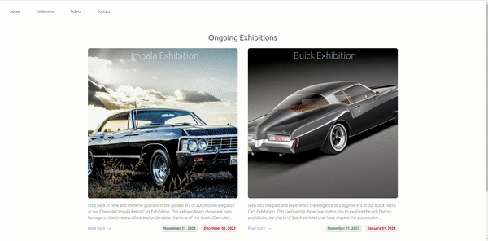

# Car Exhibitions CMS

Welcome to the Car Exhibition CMS project! This project is designed to manage and display information about car exhibitions in Germany. It consists of both a Django backend for managing data and a React frontend for an engaging user interface. This is ongoing public project which is a part of my public portfolio. It was created, among others, for the purpose of demonstrating my coding skills for clients who are interested to hire me.



## Table of Contents

- [Features](#features)
- [Stack](#requirements)
- [Getting Started](#getting-started)
- [Project Structure](#project-structure)
- [Backend](#backend)
- [Frontend](#frontend)
- [Docker](#docker)
- [License](#license)

## Features

- Display information about various car exhibitions.
- Detailed information about each exhibition, including images, dates, and location.
- Aggregation of car exhibitions in Germany.

## Stack

- [Python](https://www.python.org/)
- [React.js](https://nodejs.org/)
- [Tailwindcss](https://tailwindcss.com/)
- [Docker](https://www.docker.com/)

## Getting Started

1. Clone the repository:

   ```bash
   git clone https://github.com/AlekseiMikhalev/django-car-exhibitions.git
   ```

2. Rename `example.env` into `.env`

3. Start the development servers:

   ```bash
   # Start the docker
   docker-compose up
   ```

4. Open your browser and go to [http://localhost:3000](http://localhost:3000) to view the application.

## Project Structure

- `backend/`: Django backend code.
- `frontend/`: React frontend code.

## Backend

The backend is built with Django and includes models for exhibitions and cars. It provides RESTful APIs for retrieving exhibition details and associated cars.

## Frontend

The frontend is built with React and communicates with the Django backend to display information about car exhibitions.

## Docker

The project includes Docker configurations for both the backend and frontend. You can use Docker for development or deployment.

- Backend Dockerfile: [backend/Dockerfile](backend/Dockerfile)
- Frontend Dockerfile: [frontend/Dockerfile](frontend/Dockerfile)

## License

This project is licensed under the [MIT License](LICENSE).
